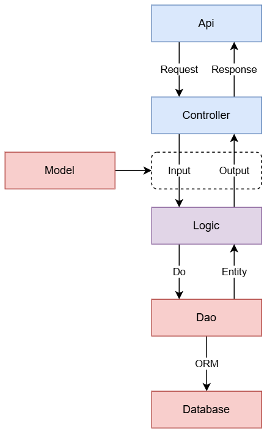

本章将正式开发**星辰英语本**项目，我们将开发第一个接口：用户注册，以提供用户注册功能。

## 代码分层
---
`GoFrame`框架具有出色的代码分层设计，软件结构清晰明了。在开发过程中，可以遵循“三板斧”法则：首先在 `Api` 层定义接口信息，然后由 `Controller` 层接收 `HTTP` 接口请求，最后调用 `Logic` 层完成具体逻辑和数据库交互。这实际上是 `MVC` 思想的一类变种。




## ORM
---
`ORM`全名`Object-Relational Mapping`，其核心功能是将数据表映射为对象，在`Go`语言里一般是结构体。

经过映射后，我们可以通过操作对象来处理数据表，而避免直接编写`SQL`语句。这不仅提高了代码的可读性和维护性，还从安全性上避免了常见的 `SQL` 注入问题。

`GoFrame`通过 [gdb](https://goframe.org/docs/core/gdb) 组件内置了`ORM`功能，提供了便捷常用的`SQL`操作。 

举一个例子：
```go
ctx := gctx.New()
Users.Ctx(ctx).Where("username", "admin").One()
```

这是一个简单的查询操作，`ORM`会根据它自动生成`SQL`语句。
```sql
SELECT * FROM users WHERE username = 'admin';
```

`ORM`仅仅提供了数据表映射功能，实际上与数据库交互还需要用到数据库驱动。

## 数据库驱动
---
`GoFrame`是一款组件化的框架，为了更好的扩展性，数据库驱动做了解耦化处理，用户可以根据自己的需求选择不同的数据库驱动，从而实现对不同数据库的支持。

### 安装驱动
安装`MySQL`驱动：
```bash
$ go get -u github.com/gogf/gf/contrib/drivers/mysql/v2
```

其他数据库驱动：
```text
go get -u github.com/gogf/gf/contrib/drivers/clickhouse/v2
go get -u github.com/gogf/gf/contrib/drivers/dm/v2
go get -u github.com/gogf/gf/contrib/drivers/mssql/v2
go get -u github.com/gogf/gf/contrib/drivers/oracle/v2
go get -u github.com/gogf/gf/contrib/drivers/pgsql/v2
go get -u github.com/gogf/gf/contrib/drivers/sqlite/v2
go get -u github.com/gogf/gf/contrib/drivers/sqlitecgo/v2
```

### 引入驱动
全局引入驱动：

*main.go*
```go
package main

import (
    _ "github.com/gogf/gf/contrib/drivers/mysql/v2"
    ...
)

func main() {
    cmd.Main.Run(gctx.GetInitCtx())
}
```

### 检查驱动
完成后，我们需要检查一下数据库驱动是否安装成功。在配置文件中加入数据库配置，如果里面有内容则全部清除，保持和下面的一致：

*manifest/config/config.yaml*
```yaml
server:
    address: ":8000"         # 服务监听端口
    openapiPath: "/api.json" # OpenAPI接口文档地址
    swaggerPath: "/swagger"  # 内置SwaggerUI展示地址

database:
  default:
    link:   "mysql:root:12345678@tcp(127.0.0.1:3306)/star?loc=Local"
    debug:  true
```

修改主函数，在程序运行前检查数据库是否正常连接。

*main.go*
```go
package main

···

func main() {
    var err error

    // 检查数据库是否能连接
    err = connDb()
    if err != nil {
        panic(err)
    }

    cmd.Main.Run(gctx.GetInitCtx())
}

// connDb 检查数据库连接是否正常
func connDb() error {
    err := g.DB().PingMaster()
    if err != nil {
        return errors.New("连接到数据库失败")
    }
    return nil
}
```

运行项目，如果没有报错，说明数据库驱动安装成功。
```base
$ gf run main.go
build: .\main.go
go build -o .\main.exe  .\main.go
.\main.exe 
build running pid: 24612
2024-11-07 16:42:51.197 [INFO] {f89117371ba305188476a74abc958a23} swagger ui is serving at address: http://127.0.0.1:8000/swagger/
2024-11-07 16:42:51.197 [INFO] pid[24612]: http server started listening on [:8000]
2024-11-07 16:42:51.197 [INFO] {f89117371ba305188476a74abc958a23} openapi specification is serving at address: http://127.0.0.1:8000/api.json

  ADDRESS | METHOD |   ROUTE    |                        HANDLER                        |    MIDDLEWARE
----------|--------|------------|-------------------------------------------------------|--------------------
  :8000   | ALL    | /api.json  | github.com/gogf/gf/v2/net/ghttp.(*Server).openapiSpec |
----------|--------|------------|-------------------------------------------------------|--------------------
  :8000   | ALL    | /swagger/* | github.com/gogf/gf/v2/net/ghttp.(*Server).swaggerUI   | HOOK_BEFORE_SERVE
----------|--------|------------|-------------------------------------------------------|--------------------
```

`gf run main.go`是`GF CLI`提供的程序运行命令，当开发者修改了项目中的 `go` 文件时，该命令将停止原有程序，自动编译并运行当前程序。可用作替代`go run main.go`。