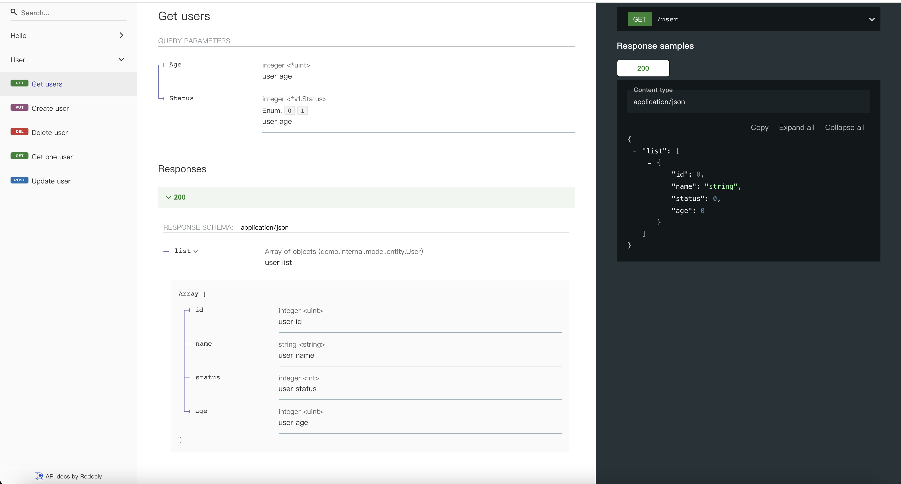

## 启动服务

我们可以使用命令行或者`IDE`自带的启动工具来启动服务，为了简化示例，我们这里直接在命令行中使用`go run main.go`来启动我们的服务：

```text
$ go run main.go
2024-11-16 16:40:07.394 [INFO] pid[39511]: http server started listening on [:8000]
2024-11-16 16:40:07.394 [INFO] {18594fad2e66081870e88c6e1440060b} swagger ui is serving at address: http://127.0.0.1:8000/swagger/
2024-11-16 16:40:07.394 [INFO] {18594fad2e66081870e88c6e1440060b} openapi specification is serving at address: http://127.0.0.1:8000/api.json

  ADDRESS | METHOD |   ROUTE    |                        HANDLER                        |           MIDDLEWARE             
----------|--------|------------|-------------------------------------------------------|----------------------------------
  :8000   | ALL    | /api.json  | github.com/gogf/gf/v2/net/ghttp.(*Server).openapiSpec |                                  
----------|--------|------------|-------------------------------------------------------|----------------------------------
  :8000   | GET    | /hello     | demo/internal/controller/hello.(*ControllerV1).Hello  | ghttp.MiddlewareHandlerResponse  
----------|--------|------------|-------------------------------------------------------|----------------------------------
  :8000   | ALL    | /swagger/* | github.com/gogf/gf/v2/net/ghttp.(*Server).swaggerUI   | HOOK_BEFORE_SERVE                
----------|--------|------------|-------------------------------------------------------|----------------------------------
  :8000   | GET    | /user      | demo/internal/controller/user.(*ControllerV1).GetList | ghttp.MiddlewareHandlerResponse  
----------|--------|------------|-------------------------------------------------------|----------------------------------
  :8000   | POST   | /user      | demo/internal/controller/user.(*ControllerV1).Create  | ghttp.MiddlewareHandlerResponse  
----------|--------|------------|-------------------------------------------------------|----------------------------------
  :8000   | DELETE | /user/{id} | demo/internal/controller/user.(*ControllerV1).Delete  | ghttp.MiddlewareHandlerResponse  
----------|--------|------------|-------------------------------------------------------|----------------------------------
  :8000   | GET    | /user/{id} | demo/internal/controller/user.(*ControllerV1).GetOne  | ghttp.MiddlewareHandlerResponse  
----------|--------|------------|-------------------------------------------------------|----------------------------------
  :8000   | PUT    | /user/{id} | demo/internal/controller/user.(*ControllerV1).Update  | ghttp.MiddlewareHandlerResponse  
----------|--------|------------|-------------------------------------------------------|----------------------------------
```

可以看到，我们开发的`CURD`接口已经成功注册到`Web Server`上，并正确显示到了终端。同时，我们启用了接口文档特性，我们看看自动生成的接口文档。

## 接口文档

根据终端打印的地址，我们访问：http://127.0.0.1:8000/swagger/



:::tip
自动化的接口文档生成也是`GoFrame`框架提供的非常强大的特性之一，我们这里不做详细的介绍，感兴趣的朋友可以参考章节：[接口文档](../../../docs/WEB服务开发/接口文档/接口文档.md)
:::

## 接口测试

为了简化测试操作，我们使用`curl`命令来做测试，并使用`json`格式提交和接受返回参数。

:::tip
以下执行命令中前面的`$`符号，表示终端命令行工具的提示符号，并不是我们输入命令的一部分，不同的终端命令行提示符号不同。
:::

### 创建接口

创建请求需要使用`POST`方式提交。

```bash
$ curl -X POST 'http://127.0.0.1:8000/user' -d '{"name":"john","age":20}'
{"code":0,"message":"","data":{"id":1}}

$ curl -X POST 'http://127.0.0.1:8000/user' -d '{"name":"alice","age":18}'
{"code":0,"message":"","data":{"id":2}}
```
这里返回的`code`为`0`表示执行成功。

我们构造不符合校验规则的请求，看看效果：

```bash
$ curl -X POST 'http://127.0.0.1:8000/user' -d '{"name":"smith","age":16}'
{"code":51,"message":"The Age value `16` must be between 18 and 200","data":null}

$ curl -X POST 'http://127.0.0.1:8000/user' -d '{"name":"sm","age":18}'
{"code":51,"message":"The Name value `sm` length must be between 3 and 10","data":null}
```

可以看到，校验规则起了作用，返回了具体的校验错误信息，错误码`code`为`51`，这个是框架内置的错误码，表示校验错误，开发者也可以自定义错误码。更多的错误码介绍请查看开发手册相关章节。

### 查询接口

#### 查询单条数据
```bash
$ curl -X GET 'http://127.0.0.1:8000/user/1'
{"code":0,"message":"","data":{"id":1,"name":"john","status":0,"age":20}}

$ curl -X GET 'http://127.0.0.1:8000/user/2'
{"code":0,"message":"","data":{"id":2,"name":"alice","status":0,"age":18}}
```

#### 查询数据列表

```bash
$ curl -X GET 'http://127.0.0.1:8000/user'
{"code":0,"message":"","data":{"list":[{"id":1,"name":"john","status":0,"age":20},{"id":2,"name":"alice","status":0,"age":18}]}}

$ curl -X GET 'http://127.0.0.1:8000/user?age=18'
{"code":0,"message":"","data":{"list":[{"id":2,"name":"alice","status":0,"age":18}]}}
```

### 修改接口

创建请求需要使用`PUT`方式提交。

```bash
$ curl -X PUT 'http://127.0.0.1:8000/user/1' -d '{"age":26}'
{"code":0,"message":"","data":null}
```

执行成功后，我们再查询对应的数据，看看是否已经修改成功：

```bash
$ curl -X GET 'http://127.0.0.1:8000/user/1'
{"code":0,"message":"","data":{"id":1,"name":"john","status":0,"age":26}}
```

### 删除接口

创建请求需要使用`DELETE`方式提交。

```bash
$ curl -X DELETE 'http://127.0.0.1:8000/user/1'
{"code":0,"message":"","data":null}
```

执行成功后，我们再查询所有的数据列表，看看是否已经被删除：

```bash
$ curl -X GET 'http://127.0.0.1:8000/user'
{"code":0,"message":"","data":{"list":[{"id":2,"name":"alice","status":0,"age":18}]}}
```

可以看到，数据已经被成功删除了。


## 学习小结

可以看到，通过`GoFrame`框架的脚手架工具生成的项目模板，我们可以很高效、快速地完成接口开发工作，并且能自动生成接口文档，方便前后端协作。


到此为止，一个使用`GoFrame`框架的`CURD`接口项目便快速完成了。但`GoFrame`框架的优秀之处，还远不止于此，她的更多特性，等待着您的进一步探索。
