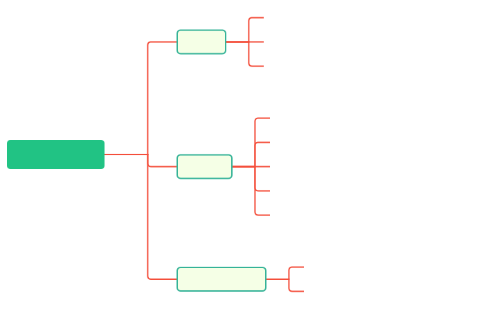

Before developing a real project, it is essential to understand the project requirements as they form the foundation for subsequent development. If the foundation is not solid, everything built upon it will be shaky.

**Star English Book** is lightweight software designed to help users learn English vocabulary and provides the following features:
- User registration;
- Manage their vocabulary after logging in;
- Randomly retrieve several words for review;
- Ability to set the proficiency level of words.

Starting from the feature points, we can create a more intuitive mind map:


## Front-end and Back-end Separation
---
As previously mentioned, this project does not involve any front-end development, so it is necessary to explain how the front end should handle it.

For a web application, the front end and back end are two vital components. The front end refers to the interactive pages users can operate, typically built with `HTML`, `CSS`, and `JavaScript`; it represents the face of the software program. The front end doesn't provide any data; it is merely a tool for displaying data, with the data source being the back end. The back end supplies all the application data and processes it, serving as the core of the software program.

Many years ago, there was no clear boundary between the front end and back end, and typically back-end programming languages would directly output `HTML` pages. As the internet developed, front-end pages became increasingly complex, placing a heavy burden on back-end programmers. Thus, front-end and back-end separation gradually became mainstream, and many frameworks emerged on the front end, such as `Vue`, `React`, `Angular`, etc., which help better manage front-end projects.

The design purpose of **Star English Book** is to enable readers to quickly master `GoFrame`, so it also adopts the front-end and back-end separation model. All developed content does not directly output `HTML`, but bypasses the front end, directly outputting standard `JSON` format data.

### JSON
`JSON` is currently the most mainstream data format for front-end and back-end interaction. Data returned by a standard interface is as follows:
```json
{
    "code": 0,
    "message": "",
    "data": {
        "id": 1,
        "uid": 1,
        "word": "example",
        "definition": "A representative form or pattern.",
        "exampleSentence": "This is an example sentence.",
        "chineseTranslation": "例子",
        "pronunciation": "ɪɡˈzɑːmp(ə)l",
        "proficiencyLevel": 3,
        "createdAt": "2024-11-12 15:38:50",
        "updatedAt": "2024-11-13 14:42:19"
    }
}
```
`code` represents the status code, where `0` means success; `message` is a custom message, and `data` is the response data.

Once the front-end developers retrieve the `JSON` data through an `HTTP` request, they can then fully utilize their expertise to construct specific pages.