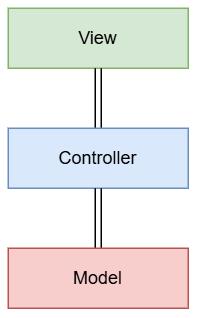

If you are already familiar with `MVC`, you can skip this section. If you are a beginner, you need to understand the `MVC (Model-View-Controller)` design architecture.

`MVC` divides an application into three main components: Model, View, and Controller.

- **Model**: Responsible for the application's data and business logic. Directly manages data, logic, and rules. Interacts with the database to handle data storage and retrieval.
- **View**: Responsible for data display and the user interface. Directly interacts with the user, presenting data and receiving user input. Updates the display to reflect the latest state of the model.
- **Controller**: Responsible for processing user input and requests. Receives input from the view, processes it, and updates the model or view. Acts as an intermediary between the model and view, orchestrating their interaction.

Since we have separated the front-end and back-end, the `View` layer is actually handled by the front-end. We only need to focus on the `Controller` and `Model` layers. It should be noted that `MVC` is just a design concept, and there is no need to delve too deeply into it.