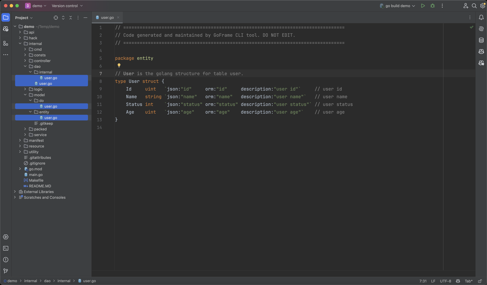

## CLI Tool Configuration

Before using the scaffolding tool, please check whether the local `cli` tool configuration is correct. The default configuration is as follows:

```yaml title="hack/config.yaml"

# CLI tool, only in development environment.
# https://goframe.org/docs/cli
gfcli:
  gen:
    dao:
    - link: "mysql:root:12345678@tcp(127.0.0.1:3306)/test"
      descriptionTag: true

  docker:
    build: "-a amd64 -s linux -p temp -ew"
    tagPrefixes:
    - my.image.pub/my-app
```

- The `dao` section configuration is the configuration for the command to be executed this time, where `link` is the database configuration required for connection. `descriptionTag` indicates adding field descriptions to the `description` tag in the generated `entity` code file. If the `entity` object of the data table is used in the interface `api` definition, this tag can serve as a parameter description. We need to change this `link` configuration to our database connection address. For a detailed introduction to the `link` configuration item, please refer to the section [ORM Configurations - Configuration File](../../../docs/核心组件/数据库ORM/ORM使用配置/ORM使用配置-配置文件.md).
- The `docker` configuration item is a configuration template provided by default, used for image compilation. It is not explained in detail here, but those interested can refer to the development manual's relevant sections on development tools.

## Execute Code Generation

After creating the data tables, we execute `make dao` in the project's root directory to automatically generate the corresponding `dao/do/entity` files.

```text
$ make dao
generated: /Users/john/Temp/demo/internal/dao/user.go
generated: /Users/john/Temp/demo/internal/dao/internal/user.go
generated: /Users/john/Temp/demo/internal/model/do/user.go
generated: /Users/john/Temp/demo/internal/model/entity/user.go
done!
```

:::tip
The `make` command is a directive provided by default under `*nix` systems, including `Linux/MacOS`. If on other systems such as `Windows`, which do not support the `make` command by default, you can use the `gf gen dao` command as a replacement.
:::



Each table will generate three types of `Go` files:
- `dao`: Access the underlying data source through object methods, implemented based on the `ORM` component.
- `do`: Data transformation model for converting business models to data models, maintained by the tool and cannot be modified by users. The tool will overwrite this directory each time code files are generated.
- `entity`: Data model, maintained by the tool and cannot be modified by users. The tool will overwrite this directory each time code files are generated.

For a more detailed introduction, please refer to the section [Data Specification - gen dao](../../../docs/开发工具/代码生成-gen/数据规范-gen%20dao.md)

:::info
The code generated by the scaffolding tool includes a top-level file comment. If the file comment contains the description `Code generated and maintained by GoFrame CLI tool. DO NOT EDIT.`, it means the file is maintained by the scaffolding tool and will be overwritten with each code generation.
:::

### dao

Two `dao` files are generated:
- `internal/dao/internal/user.go` is used to wrap access to the data table `user`. This file automatically generates some data structures and methods to simplify `CRUD` operations on the data table. This file is overwritten each time it is generated and is automatically maintained by the development tools, so developers do not need to worry about it.
- `internal/dao/user.go` is actually a further encapsulation of `internal/dao/internal/user.go`, used for direct access by other modules. Developers can modify this file as desired or extend the capabilities of `dao`.

Since the generated `internal/dao/internal/user.go` file is completely maintained by the development tools, we only need to care about this generated source file `internal/dao/user.go`, and make any functional extensions if needed.

Sample source code: https://github.com/gogf/quick-demo/blob/main/internal/dao/user.go

```go title="internal/dao/user.go"
// =================================================================================
// This is auto-generated by GoFrame CLI tool only once. Fill this file as you wish.
// =================================================================================

package dao

import (
    "demo/internal/dao/internal"
)

// internalUserDao is internal type for wrapping internal DAO implements.
type internalUserDao = *internal.UserDao

// userDao is the data access object for table user.
// You can define custom methods on it to extend its functionality as you wish.
type userDao struct {
    internalUserDao
}

var (
    // User is globally public accessible object for table user operations.
    User = userDao{
        internal.NewUserDao(),
    }
)

// Fill with you ideas below.
```

### do

Sample source code: https://github.com/gogf/quick-demo/blob/main/internal/model/do/user.go

```go title="internal/model/do/user.go"
// =================================================================================
// Code generated and maintained by GoFrame CLI tool. DO NOT EDIT.
// =================================================================================

package do

import (
    "github.com/gogf/gf/v2/frame/g"
)

// User is the golang structure of table user for DAO operations like Where/Data.
type User struct {
    g.Meta `orm:"table:user, do:true"`
    Id     interface{} // user id
    Name   interface{} // user name
    Status interface{} // user status
    Age    interface{} // user age
}
```

The usage of the `do` data transformation model will be demonstrated in subsequent code logic.

### entity

Sample source code: https://github.com/gogf/quick-demo/blob/main/internal/model/entity/user.go

```go title="internal/model/entity/user.go"
// =================================================================================
// Code generated and maintained by GoFrame CLI tool. DO NOT EDIT.
// =================================================================================

package entity

// User is the golang structure for table user.
type User struct {
	Id     uint   `json:"id"     orm:"id"     description:"user id"`     // user id
	Name   string `json:"name"   orm:"name"   description:"user name"`   // user name
	Status int    `json:"status" orm:"status" description:"user status"` // user status
	Age    uint   `json:"age"    orm:"age"    description:"user age"`    // user age
}
```

We can see that this `entity` data structure definition corresponds directly to the data table fields.

## Learning Summary

It can be felt that using the convenient scaffolding tools of the `GoFrame` framework, we are liberated from some repetitive coding labor, greatly improving production efficiency. Operations on the database will become very simple.

In the next step, we will design the `CRUD` interface, to see how to quickly define an interface in the `GoFrame` framework.