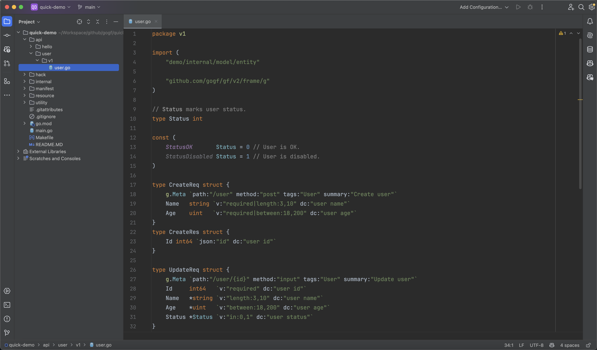

In the `api` directory of the project, we begin defining our `CRUD` APIs.
- We use the `RESTful` style for API design, fully utilizing the `GET/POST/PUT/DELETE` HTTP Methods. This standardized design results in very elegant APIs.
- Similarly, we start with version `v1`. Using version numbers is a good development habit, which helps in maintaining compatibility in future APIs.



## `Create`
```go title="api/user/v1/user.go"
type CreateReq struct {
    g.Meta `path:"/user" method:"post" tags:"User" summary:"Create user"`
    Name   string `v:"required|length:3,10" dc:"user name"`
    Age    uint   `v:"required|between:18,200" dc:"user age"`
}
type CreateRes struct {
    Id int64 `json:"id" dc:"user id"`
}
```
Brief Introduction:
- In API definitions, `g.Meta` is used to manage interface metadata information, which are defined as tags on the `g.Meta` property. These metadata include `path` (route address), `method` (request method), `tags` (interface group for generating interface documentation), and `summary` (interface description). These metadata are part of `OpenAPIv3`, which we won't go into detail here. For those interested, refer to the chapter: [Interface Documentation - OpenAPIv3](../../../docs/WEB服务开发/接口文档/接口文档-OpenAPIv3.md).
- The `Name` and `Age` attributes here are the parameter definitions for our interface. The `dc` tag is a shorthand for `description`, indicating the meaning of the parameter; the `v` tag is a shorthand for `valid`, indicating the validation rules for the parameter. We use three built-in validation rules here:
  - `required`: The parameter is mandatory.
  - `length`: Validates the parameter's length.
  - `between`: Validates the parameter's range.
  Learn about these here, and refer to the section [Data Validation - Validation Rules](../../../docs/核心组件/数据校验/数据校验-校验规则.md) for more validation rules.
- The request parameter structure `CreateReq` does not specify parameter reception methods because the `GoFrame` framework supports very flexible parameter reception methods, automatically recognizing `Query String/Form/Json/Xml` submission methods and mapping the submitted parameters to the request parameter receiving objects.
- Only the return parameter structures have `json` tags because the returned data usually needs to be converted to `json` format for use by the frontend, and parameter naming in `snake` style is more in line with frontend naming conventions.

:::tip
In a `RESTful` style interface design, we typically use `POST` from the `HTTP Method` to denote write operations and `PUT` to denote update operations.
:::

## `Delete`

```go title="api/user/v1/user.go"
type DeleteReq struct {
    g.Meta `path:"/user/{id}" method:"delete" tags:"User" summary:"Delete user"`
    Id     int64 `v:"required" dc:"user id"`
}
type DeleteRes struct{}
```

The route tag `path` uses `/user/{id}`, where `{id}` indicates a field-matching route, passed through the `URL Path`, with the parameter name `id`. As seen, we define an `Id` parameter in the request parameter object, and the `id` parameter from the route will **map directly without case sensitivity** to this `Id`.

For example: In the route `/user/1`, the `id` parameter value is `1`; in the route `/user/100`, the `id` parameter value is `100`.

## `Update`

```go title="api/user/v1/user.go"
// Status marks user status.
type Status int

const (
    StatusOK       Status = 0 // User is OK.
    StatusDisabled Status = 1 // User is disabled.
)

type UpdateReq struct {
    g.Meta `path:"/user/{id}" method:"put" tags:"User" summary:"Update user"`
    Id     int64   `v:"required" dc:"user id"`
    Name   *string `v:"length:3,10" dc:"user name"`
    Age    *uint   `v:"between:18,200" dc:"user age"`
    Status *Status `v:"in:0,1" dc:"user status"`
}
type UpdateRes struct{}
```

Here:
- We define a user status type `Status`, using the conventional `enums` definition style in `Golang`. Just for understanding here.
- The validation for the `Status` parameter uses the `in:0,1` rule, which checks that the passed `Status` value must be one of the two constants we defined, `StatusOK/StatusDisabled`, i.e., `0/1`.
- The interface parameters use pointers to avoid default type values affecting our update interface. For example, if `Status` is not defined as a pointer, it will be affected by the default value `0`. During processing logic, it's hard to determine whether the caller has passed the parameter and whether to actually change the value to `0`. By using pointers, when users don't pass the parameter, its default value is `nil`, making it easy to judge in processing logic.

## `GetOne` 

```go title="api/user/v1/user.go"
type GetOneReq struct {
    g.Meta `path:"/user/{id}" method:"get" tags:"User" summary:"Get one user"`
    Id     int64 `v:"required" dc:"user id"`
}
type GetOneRes struct {
    *entity.User `dc:"user"`
}
```

Here, the return result uses the `*entity.User` structure, which was generated by the `make dao` command earlier. This data structure corresponds to the database table fields one-to-one.

## `GetList` 

```go title="api/user/v1/user.go"
type GetListReq struct {
    g.Meta `path:"/user" method:"get" tags:"User" summary:"Get users"`
    Age    *uint   `v:"between:18,200" dc:"user age"`
    Status *Status `v:"in:0,1" dc:"user age"`
}
type GetListRes struct {
    List []*entity.User `json:"list" dc:"user list"`
}
```
This interface can query by `Age` and `Status`, returning multiple records `List []*entity.User`.

## Learning Summary

Sample code for this chapter: https://github.com/gogf/quick-demo/blob/main/api/user/v1/user.go

As shown, defining `api` interfaces in the `GoFrame` framework's scaffolding project is quite elegant, with support for automatic data validation, metadata injection, flexible route configuration, and other practical features. This method of interface definition allows for the automatic generation of interface documentation, where the code serves as documentation, ensuring consistency between code and documentation.

Moreover, this is not the full charm of `GoFrame`, just a single petal on the rose. Next, we will use scaffold tools to automatically generate the corresponding `controller` control code for us.